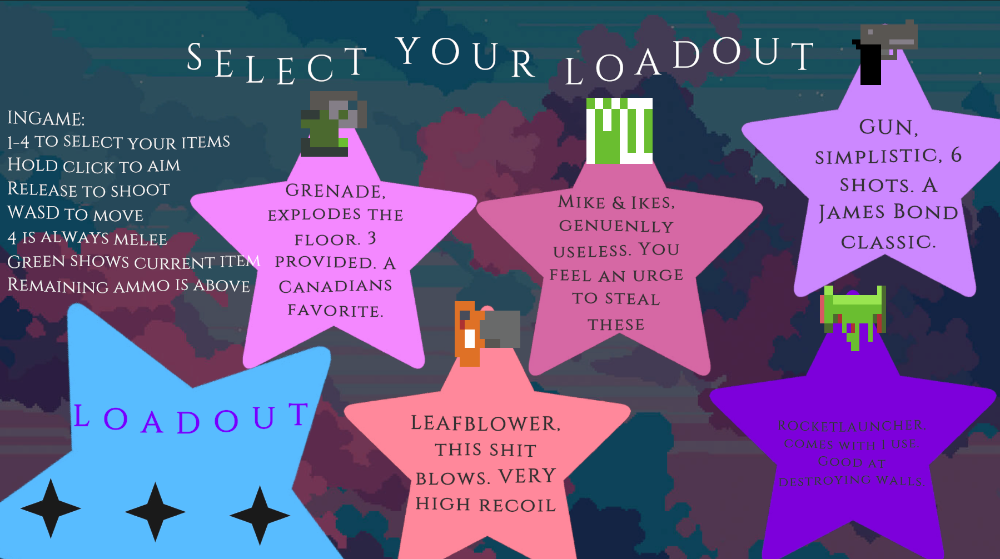
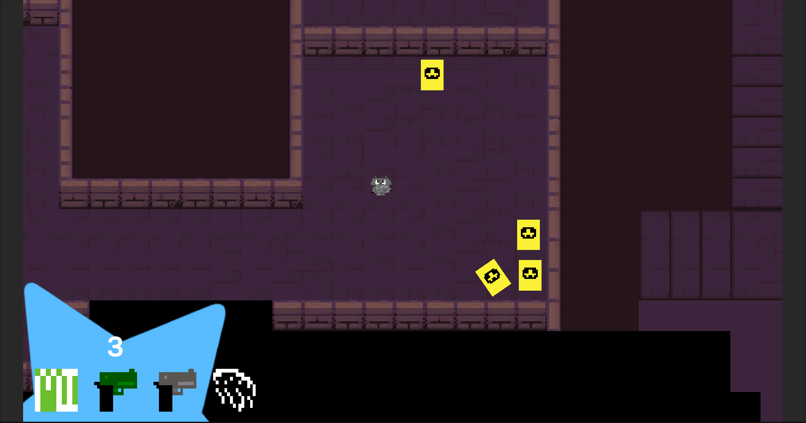
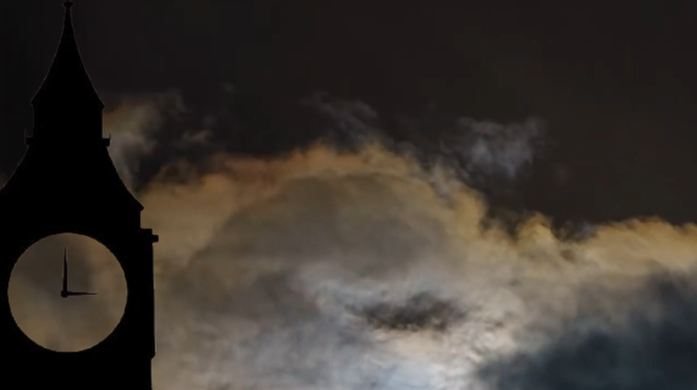

# grey firmament
## this is a game where the sky is illegal, and you do crimes.
The year is 8888, and Beijing has banned public access to the sky. However, Racchias (the Chinese racoon) is determined to climb the last remaining tower in hopes of finally seeing the stars of his dreams

### COMPILING FROM SOURCE NOTES:

To compile the game, download the source code from this repository, and open it in Unity 6000.3.8f1. Then, click on File > Build Settings, select your platform, and click Build.

***If you don't want to compile the game from source, a playable build is available in the GitHub Releases*** 

a web build for grey firmament will be available soon™ (the last time i slept was 2 days ago and i only got 5h. im not doing anything else other than minimum for full release right now)

### Cast:
- Racchias: A Chinese racoon who grew up without parents, and only a children's book to his name. He has a dream of finally seeing the stars.

### Gameplay:
- Climb the Clocktower using different sets of abilities
- Discover interactions between your abilities, the AI, and your environment
- Experience the touching story of Racchias, a racoon with one last dream.

### Screenshots:

### Controls:
- WASD to move around
- 1-4 to select different items from your hot bar
- Hold Click to slow time 
- Release Click to activate currently selected weapon
- P to skip cutscenes, or to rewatch the opening one if on the Loadout menu

### How to Play:
- Before entering a level, pick 3 tools for your use during the level
- During the level, experiment with these 3 tools to get past various obstabcles so you can reach the ladder at the end
- If you die, you're given the chance to change your loadout before trying again
### Inspiration:
Streets of Rogue was the primary inspiration.
### Credits: 
- arborium did all the programming and cutscenes
- Khan did gameplay music, art, and level design

### Development:
This game was developed in Unity 6000.3.8f1 over the course of 2 days for Hack Club Horizons Polaris.

Our theme was "The stars reward those who dare to improvise."

### Tools Used:
- Unity 6000.3.8f1
- Aseprite
- Musescore
- GitHub
- Jetbrains Rider

### AI Disclosure:
AI was used for debugging, as well as autocomplete. NO AI WAS USED FOR ANY OF THE ART, CUTSCENES, MUSIC, OR WRITING. 

(the readme was also made by a human if you couldn't already tell)

### plans for the future?
we might come back to this at some point, but for now the only forseeable updates are bugfixes and other platform releases! 

### fun fact:
grey firmament comes from 2 parts, grey (which refers to the constant smog) and firmament (which is like some kind of barrier)